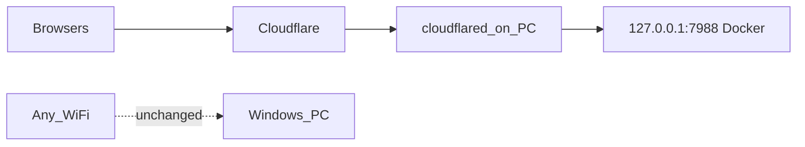

## Docker auto-deploy (GPU or OpenVINO)

Canonical layout: **[`docker/`](docker/)** (`cuda124` / `cuda126` / `latest` / `openvino`).

```bat
.\Deploy-Docker.bat
.\Deploy-Docker.bat gpu -Build
.\Deploy-Docker.bat gpu -CudaStack cuda126 -Build
.\Deploy-Docker.bat gpu -CudaStack cuda124 -Build
.\Deploy-Docker.bat openvino -Build
```

| Key | Values |
|-----|--------|
| `DEPLOY_BACKEND` | `auto` / `gpu` / `openvino` |
| `DEPLOY_CUDA_STACK` | `latest` / `cuda126` / `cuda124` |
| `DEPLOY_LOOPBACK` | `0` / `1` |

- GPU UI: http://localhost:7988  
- OpenVINO UI: http://localhost:7987  

Details: [`docker/README.md`](docker/README.md), [`configs/CUDA.md`](configs/CUDA.md).

Full public hostname / Cloudflare / nginx: **[`SETUP.md`](SETUP.md)**.

---

# Public / LAN deployment (Windows + Docker GPU) — WiFi-safe

**Full step-by-step (Cloudflare, nginx, DNS, auth, travel):** see **[`SETUP.md`](SETUP.md)**.

Primary path: **NVIDIA GPU Docker** upstream on **127.0.0.1:7988** (use `DEPLOY_LOOPBACK=1`).

**Public hostname for this project:** `asrservice.demotoday.th`

## Which public mode to use

| Situation | Use |
|-----------|-----|
| **Travel / hotel / cafe / new office WiFi** (cannot port-forward) | **Cloudflare Tunnel** — [`Setup-TravelTunnel.ps1`](scripts/Setup-TravelTunnel.ps1) |
| Home/office where you control the router | nginx + DNS A record + port-forward — [`Setup-PublicAccess.ps1`](scripts/Setup-PublicAccess.ps1) |
| Same LAN only | `-Audience lan` |

**Traveling changes your public IP and router.** Port-forward + static DNS A record will break every time you move. A tunnel keeps the **same name** because traffic is outbound from the PC to Cloudflare; no inbound router rules required.



## WiFi-safe rules

Deploy scripts **must not**:

- Change WiFi adapter IP, DNS, gateway, metric, or MTU
- Enable ICS / bridge WiFi to Docker/WSL
- Publish Gradio on `0.0.0.0:7988`
- Reset firewall profiles or delete unrelated WiFi rules

They **only** bind Docker to loopback and (for home mode) nginx/firewall 80/443, or (for travel) an outbound Cloudflare tunnel container.

---

## Travel mode (recommended if you move the PC)

### One-time (Cloudflare + DNS for demotoday.th)

1. Cloudflare Zero Trust → Networks → Tunnels → Create tunnel (e.g. `local-transcript`)
2. Copy the token into `.env`:
   ```
   CLOUDFLARE_TUNNEL_TOKEN=eyJ...
   APP_PUBLIC_BASE_URL=https://asrservice.demotoday.th
   ```
3. Tunnel public hostname:
   - Hostname: `asrservice.demotoday.th`
   - Service: `http://host.docker.internal:7988`
4. DNS (proxied / orange cloud):  
   `CNAME asrservice.demotoday.th` → `<tunnel-id>.cfargotunnel.com`

### Every location (hotel, office, home)

Connect to WiFi, then:

```powershell
.\deploy\scripts\Setup-TravelTunnel.ps1
```

That starts:

- GPU Docker on `127.0.0.1:7988` only ([`docker-compose.proxy-override.yml`](docker-compose.proxy-override.yml))
- `cloudflared` ([`docker-compose.tunnel.yml`](docker-compose.tunnel.yml)) outbound to Cloudflare

Same URL everywhere: **https://asrservice.demotoday.th**  
Keep Gradio auth set (`GRADIO_AUTH_USER` / `GRADIO_AUTH_PASSWORD`).

Manual equivalent:

```powershell
docker compose -f docker-compose.gpu.yml -f deploy/docker-compose.proxy-override.yml -f deploy/docker-compose.tunnel.yml up -d
```

---

## Home/office mode (nginx + router forward)

Only when you control the router and stay on one network:

```powershell
.\deploy\scripts\Setup-PublicAccess.ps1 -Proxy nginx -Audience internet -PublicHost asrservice.demotoday.th -EnableTls
```

Then:

1. DNS **A record** `asrservice.demotoday.th` → that site’s public WAN IP  
2. Router forward TCP **80/443** → this PC’s LAN/WiFi IP  
3. DHCP reservation for the PC  

If you later travel, switch to **Travel mode** (tunnel). Do not rely on updating A records manually at every hotel.

LAN-only:

```powershell
.\deploy\scripts\Setup-PublicAccess.ps1 -Audience lan
```

---

## Optional Gradio env

| Variable | Purpose |
|----------|---------|
| `CLOUDFLARE_TUNNEL_TOKEN` | Travel tunnel token (Zero Trust) |
| `GRADIO_AUTH_USER` / `GRADIO_AUTH_PASSWORD` | Gradio basic auth |
| `APP_PUBLIC_BASE_URL` | `https://asrservice.demotoday.th` |
| `UI_MAX_CONCURRENT_JOBS` | Keep **1** on 8 GB VRAM |

## Limits

- One GPU host; jobs queue on 8 GB
- Basic auth only
- Hotels may block outbound uncommon ports; Cloudflare Tunnel uses normal HTTPS outbound and usually works
- Corporate SSL inspection / captive portals can still block the tunnel until you complete guest login

## IIS

Removed from this deploy path. Use **nginx** (home) or **Cloudflare Tunnel** (travel). See [`SETUP.md`](SETUP.md).
